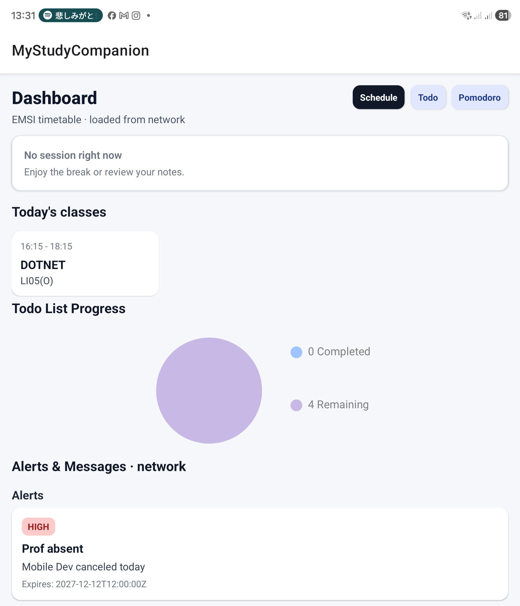
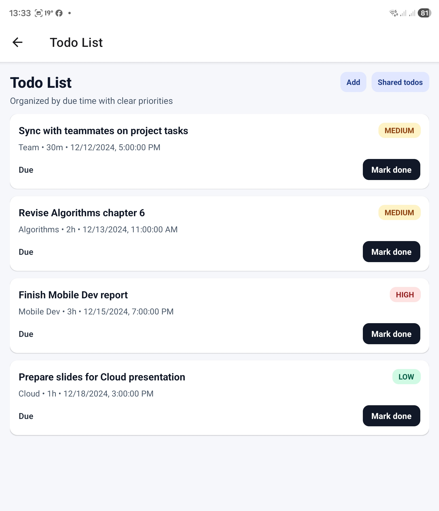
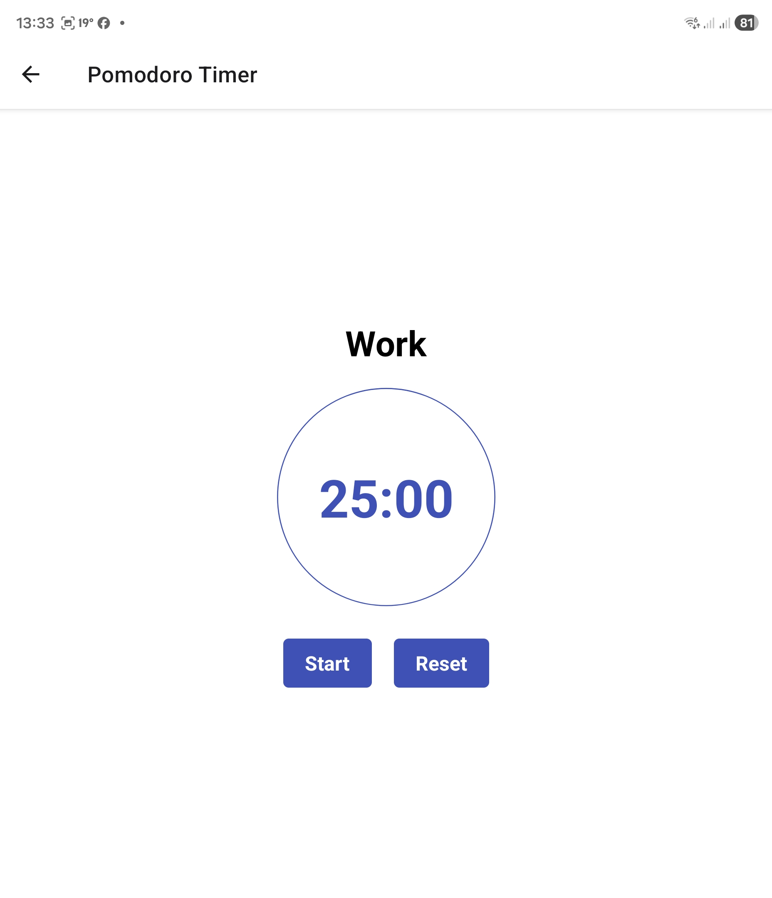
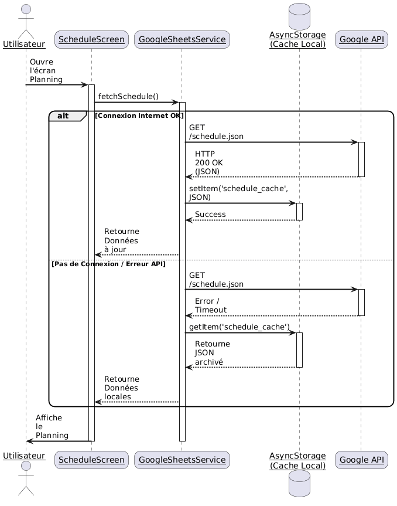
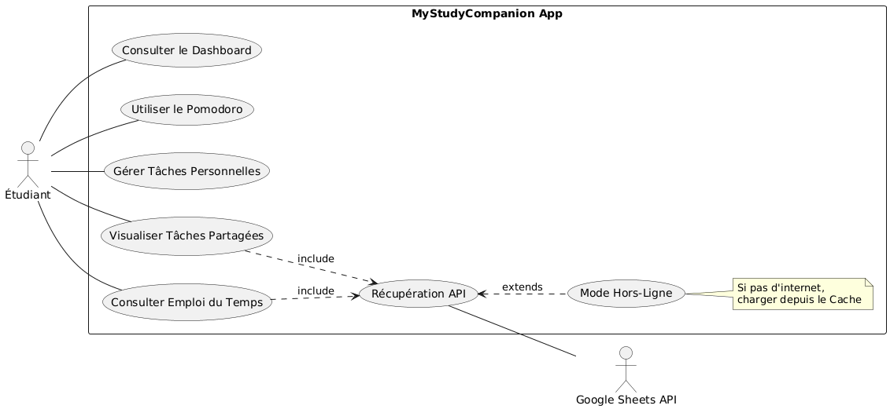
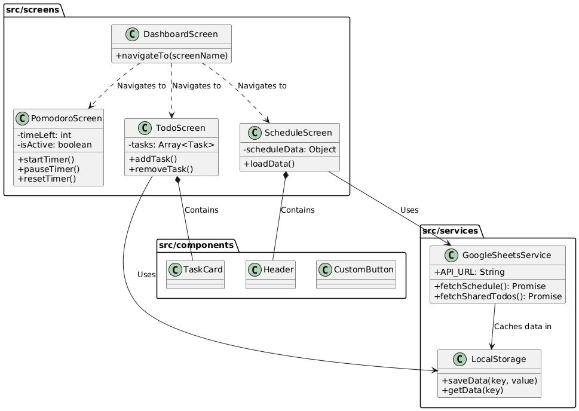

# MyStudyCompanion 📱🎓

<p align="center">
  
</p>


> Application mobile d'assistance à la productivité et à l'organisation pour les étudiants de l'EMSI (Offline-First, React Native + Expo).

📄 Rapport complet (PDF) : `rapportDEVMOBILE.pdf`

---

## Sommaire
- [Vue d'ensemble](#vue-densemble)
- [Remerciements](#remerciements)
- [Résumé / Abstract](#résumé--abstract)
- [Contexte académique](#🏫-contexte-académique)
- [Problématique et solution](#problématique-et-solution)
- [Fonctionnalités clés](#🚀-fonctionnalités-clés)
- [Aperçu visuel](#📱-aperçu-visuel)
- [Architecture et conception](#🛠-architecture-et-conception)
- [Implémentation](#⚙️-implémentation)
- [Installation](#💻-installation--démarrage)
- [Gestion de projet](#📈-gestion-de-projet)
- [Difficultés techniques](#🧩-difficultés-techniques)
- [Roadmap / Perspectives](#🔮-roadmap--perspectives)
- [Références](#📚-références)
- [Licence](#licence)

---

## Vue d'ensemble
- App mobile cross-platform (Android/iOS) qui centralise emploi du temps, tâches et minuteur Pomodoro.
- Fonctionne sans connexion grâce au cache local (`AsyncStorage`) et se synchronise avec Google Sheets.
- Architecture modulaire (Clean Architecture), navigation par Native Stack, design pensé pour un usage étudiant.

---

## Remerciements
Merci au **Pr. Rachik Zineb** pour l'encadrement technique, ainsi qu'au corps professoral de l'EMSI pour la qualité de la formation.  
Équipe projet : **Karim HANFAOUI** & **Imane KAFIF** (G9).

---

## Résumé / Abstract
**Résumé (FR)** — Conception d'une application mobile cross-platform dédiée à la productivité étudiante (Pomodoro, To-Do, emploi du temps synchronisé). L'approche **Offline-First** garantit l'accès même sans internet, avec synchronisation légère via Google Sheets.  
**Mots-clés :** React Native, Expo, Offline-First, AsyncStorage, Google Sheets, Productivité.

**Abstract (EN)** — Cross-platform mobile app to enhance student productivity (Pomodoro timer, task manager, synchronized schedule). Built with React Native + Expo using an Offline-First architecture (local cache with cloud sync).  
**Keywords:** React Native, Expo, Offline-First, AsyncStorage, Google Sheets, Productivity.

---

## 🏫 Contexte Académique
Projet réalisé dans le cadre du module **Développement Mobile** (4ème année IIR, EMSI).
- **Année Universitaire :** 2024/2025
- **Encadrant :** Pr. Rachik Zineb
- **Équipe (Groupe G9) :** 👨‍💻 Karim HANFAOUI — 👩‍💻 Imane KAFIF

<p align="center">
  
</p>

---

## Problématique et solution
**Problématique :** Multitude de canaux (WhatsApp, emails, affichages papier) rendant la gestion académique pénible, surtout sans réseau dans les amphithéâtres.  
**Solution proposée :** Une app unique et offline-first qui :
- centralise le planning (sync Google Sheets + cache local),
- sépare tâches personnelles et partagées,
- intègre un minuteur Pomodoro pour rythmer le travail.

---

## 🚀 Fonctionnalités Clés
- **Emploi du temps intelligent (Offline) :** récupération dynamique depuis Google Sheets, mise en cache, surbrillance du cours en cours.
- **Gestion de tâches hybride :** listes personnelles locales + liste "Classe" synchronisée (CRUD complet).
- **Pomodoro / Focus Mode :** cycles 25/5 minutes pour éviter le burnout.

---

## 📱 Aperçu visuel

| Tableau de Bord | Gestion des Tâches | Focus Mode |
|:---:|:---:|:---:|
|  |  |  |
| Accès rapide aux modules | Listes personnelles & partagées | Minuteur de concentration |

Autres captures : `devmobile_rapport_latex/dash2.jpg`, `stodo.jpg`, `crudtodo.jpg`.

---

## 🛠 Architecture et conception

### Stack technologique
- **Frontend :** React Native + Expo (SDK 50+)
- **Navigation :** React Navigation (Native Stack)
- **Backend léger :** Google Sheets API via `opensheet.elk.sh`
- **Persistance locale :** AsyncStorage (clé-valeur)

### Stratégie de données (Offline-First)
1. Tentative de fetch de l'API Google Sheets.
2. En cas de succès : mise à jour du cache + affichage.
3. En cas d'échec : lecture transparente depuis le cache local.


### UML / Modélisation
- **Cas d'utilisation :** interactions étudiant / Google Sheets.  
  
- **Architecture modulaire :** séparation vues / composants / services.  
  

### Arborescence du projet
```
/projetDevMobile
|-- assets                  # Images, polices, icônes
|-- src
|   |-- components          # UI réutilisables
|   |-- screens             # Dashboard, Pomodoro, Todo, Schedule...
|   |-- services            # googleSheetsService.js (API)
|   |-- navigation          # Stack Navigator
|-- App.js                  # Point d'entrée
|-- app.json / package.json # Config Expo & dépendances
```

---

## ⚙️ Implémentation

### Navigation principale (`App.js`)
```js
import { NavigationContainer } from '@react-navigation/native';
import { createNativeStackNavigator } from '@react-navigation/native-stack';
import Dashboard from './src/screens/Dashboard';
import Pomodoro from './src/screens/Pomodoro';

const Stack = createNativeStackNavigator();

export default function App() {
  return (
    <NavigationContainer>
      <Stack.Navigator initialRouteName="Dashboard">
        <Stack.Screen name="Dashboard" component={Dashboard} />
        <Stack.Screen name="Pomodoro" component={Pomodoro} />
        {/* Autres écrans : Todo, Schedule... */}
      </Stack.Navigator>
    </NavigationContainer>
  );
}
```

### Service de données (Google Sheets)
```js
export const fetchSchedule = async () => {
  try {
    const response = await fetch('URL_DE_VOTRE_GOOGLE_SHEET');
    const json = await response.json();
    return json;
  } catch (error) {
    console.error('Erreur API:', error);
    return null; // déclenche le mode hors ligne
  }
};
```

### Logique du minuteur Pomodoro (extrait)
```js
useEffect(() => {
  let interval = null;
  if (isActive && seconds > 0) {
    interval = setInterval(() => setSeconds(seconds - 1), 1000);
  } else if (seconds === 0) {
    setIsActive(false);
    alert('Session terminée !');
  }
  return () => clearInterval(interval);
}, [isActive, seconds]);
```

---

## 💻 Installation & Démarrage
Prérequis : Node.js (v18+), Expo CLI (`npm install -g expo-cli`), app **Expo Go**.

1. **Cloner le dépôt**
   ```bash
   git clone https://github.com/carteeeltheboss/projetDevMobile.git
   cd projetDevMobile
   ```
2. **Installer les dépendances**
   ```bash
   npm install
   ```
3. **Configurer Google Sheets**
   - Ouvrir `src/services/googleSheetsService.js`
   - Remplacer `SHEET_ID` par l'ID de votre Sheet (public)
   - Onglets requis : `SCHEDULE`, `ALERTS`, `TODO`
4. **Lancer l'app**
   ```bash
   npx expo start
   ```
   Scanner le QR Code avec Expo Go.

---

## 📈 Gestion de projet
- **Méthodologie agile (3 sprints) :** environnement + Dashboard → Pomodoro + Todo locale → API + design final.
- **Versionning Git :** branches par fonctionnalité, fusion dans `main`.  
  Dépôt : https://github.com/carteeeltheboss/projetDevMobile  
  

---

## 🧩 Difficultés techniques
- **Persistance Todo :** données perdues faute de `JSON.stringify`/`JSON.parse` avec AsyncStorage → corrigé.
- **Compatibilité Android (ombres) :** ajout de `elevation` pour reproduire le rendu iOS.

---

## 🔮 Roadmap / Perspectives
- Mode sombre via `Appearance`.
- Notifications push (Firebase Cloud Messaging) pour les alertes de cours.
- Authentification étudiante pour données privées.
- Tests et packaging iOS (au-delà d'Expo Go).

---

## 📚 Références
- React Native : https://reactnative.dev  
- Expo : https://docs.expo.dev  
- React Hooks : https://reactjs.org/docs/hooks-intro.html  
- AsyncStorage : https://react-native-async-storage.github.io/async-storage/

---

## Licence
Projet à but éducatif (usage académique).
